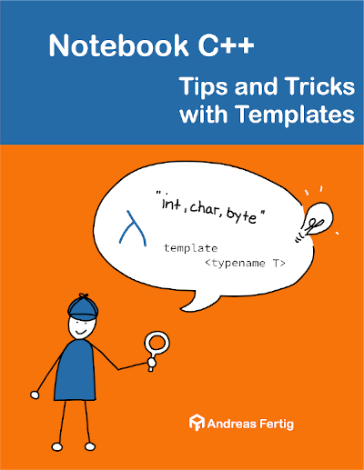

# Companion Source Code for "Notebook C++ - Tips and Tricks with Templates" 1. Edition

[](https://github.com/andreasfertig/notebookcpp-tips-and-tricks-with-templates/actions/) [](/LICENSE.txt)



## Code examples

This repository contains runnable source code examples from the 1. edition of [Notebook C++ - Tips and Tricks with Templates](https://andreasfertig.info/books/notebookcpp-tips-and-tricks-with-templates/), by [Andreas Fertig](https://andreasfertig.info).

### The layout of the examples

The examples are separated into different directories based on how they appear in the book.

### Running the examples

The examples are contained in a single `.cpp` file that can be easily executed in any IDE. There is also an `CMakeLists.txt` which can generate IDE projects or used to compile the example in a terminal.
This repo contains a top-level `CMakeLists.txt` which does build all the examples.

### Building the examples

You can select the compiler by setting the `CXX` environment variable.

```
mkdir notebookcpp-tips-and-tricks-with-templates
cd notebookcpp-tips-and-tricks-with-templates
git clone https://github.com/andreasfertig/notebookcpp-tips-and-tricks-with-templates
mkdir build
cd build
cmake ../
cmake --build . -j
```

After that you find all the executables in `notebookcpp-tips-and-tricks-with-templates/build/bin`.

Some of these examples use the latest C++ standard, so you will need a modern compiler in order to compile them. The latest stable versions of GCC or [Clang](https://releases.llvm.org/) are recommended. The code is not tested, but expected to work, with MSVC as well.

## License

The source code is released under the [MIT License](/LICENSE.txt).
